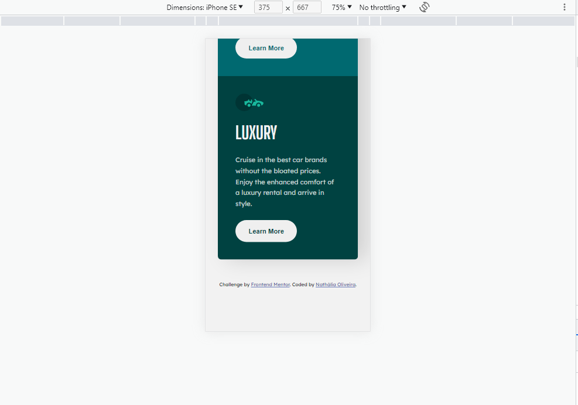

# Frontend Mentor - 3-column preview card component solution

This is a solution to the [3-column preview card component challenge on Frontend Mentor](https://www.frontendmentor.io/challenges/3column-preview-card-component-pH92eAR2-). Frontend Mentor challenges help you improve your coding skills by building realistic projects. 

## Table of contents

- [Overview](#overview)
  - [The challenge](#the-challenge)
  - [Screenshot](#screenshot)
  - [Links](#links)
- [My process](#my-process)
  - [Built with](#built-with)
  - [What I learned](#what-i-learned)
  - [Continued development](#continued-development)
  - [Useful resources](#useful-resources)
- [Author](#author)

## Overview

### Screenshot

### Links

- Solution URL: [GitHub Solution](https://github.com/nathsantoliver/3-column-preview-card-component-main/)
- Live Site URL: [3 Column Preview Card](https://3-column-preview-card-component-main-virid.vercel.app/)
- 

## My process

### Built with

- Semantic HTML5 markup
- CSS custom properties
- CSS Grid

### What I learned

I learned that in the construction of a layout, as simple as it may seem, concepts can be merged so that the construction is better understood by other people who read the code.

### Continued development

I need to delve into box model concepts, know the best time to use flexbox or grid. Training in these concepts is important for my skills in building a layout to be done in a more fluid and harmonious way.

### Useful resources

- [W3Schools CSS Tutorial](https://www.w3schools.com/css) - This helped me to understand their concepts and application examples, making me understand if it is valid to apply that concept in the code or not.
- [CSS-Tricks Snippets](https://css-tricks.com/snippets/css/) - Like W3Schools, CSS trick helped me to understand concepts, mainly the applicability of flexbox and css grid, and the best way to style the page using these concepts.

## Author

- Frontend Mentor - [@nathsantoliver](https://www.frontendmentor.io/profile/nathsantoliver)
- GitHub - [@nathsantoliver](https://github.com/nathsantoliver)
